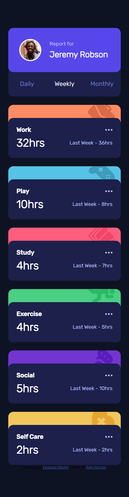
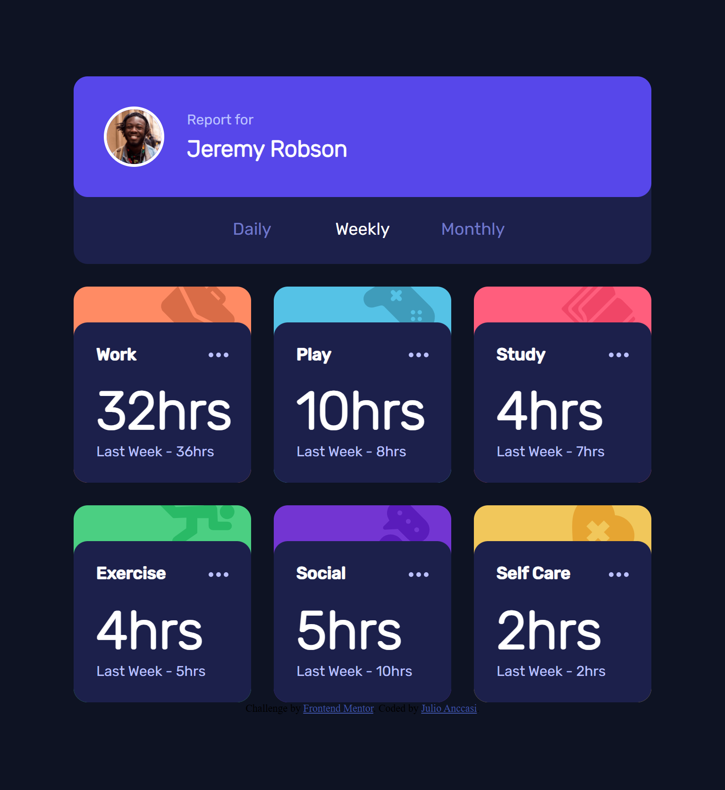
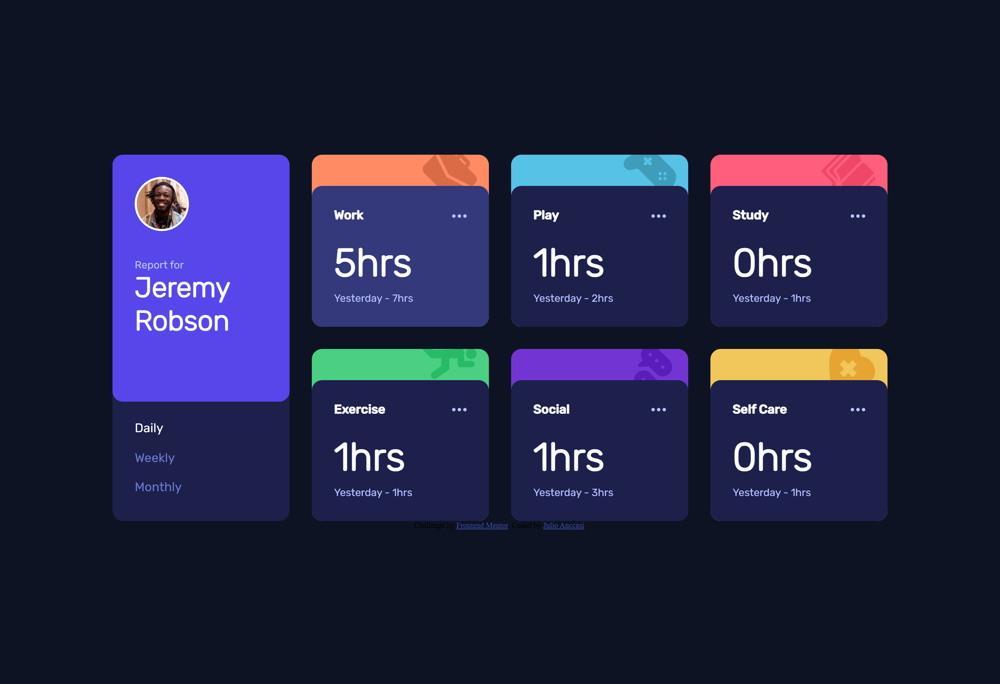

# Frontend Mentor - Time tracking dashboard solution

This is a solution to the [Time tracking dashboard challenge on Frontend Mentor](https://www.frontendmentor.io/challenges/time-tracking-dashboard-UIQ7167Jw). Frontend Mentor challenges help you improve your coding skills by building realistic projects.

## Table of contents

- [Frontend Mentor - Time tracking dashboard solution](#frontend-mentor---time-tracking-dashboard-solution)
  - [Table of contents](#table-of-contents)
  - [Overview](#overview)
    - [The challenge](#the-challenge)
    - [Screenshot](#screenshot)
    - [Links](#links)
  - [My process](#my-process)
    - [Built with](#built-with)
    - [What I learned](#what-i-learned)
    - [Continued development](#continued-development)
    - [AI Collaboration](#ai-collaboration)
  - [Author](#author)

## Overview

### The challenge

Users should be able to:

- View the optimal layout for the site depending on their device's screen size
- See hover states for all interactive elements on the page
- Switch between viewing Daily, Weekly, and Monthly stats

### Screenshot





### Links

- Solution URL: [https://github.com/ChechiX/time-tracking-dashboard](https://github.com/ChechiX/time-tracking-dashboard)
- Live Site URL: [https://chechix.github.io/time-tracking-dashboard/](https://chechix.github.io/time-tracking-dashboard/)

## My process

### Built with

- Semantic HTML5 markup
- Flexbox
- CSS Grid
- Mobile-first workflow
- JavaScript for interactivity
- [Sass](https://sass-lang.com/) - For styles

### What I learned

This was a great project to practice building a responsive layout using CSS Grid and Flexbox. I also got to work on my JavaScript skills by implementing the functionality to switch between different timeframes. One thing I learned was how to structure my JavaScript code in a way that keeps it organized and easy to read. I also got to practice using data attributes to store information on HTML elements, which made it easier to access and manipulate that data in my JavaScript. Fetching data from a JSON file and using it to dynamically update the content on the page was also a valuable learning experience. Overall, this project helped me improve my skills in both CSS and JavaScript, and I feel more confident in my ability to build responsive layouts and add interactivity to my projects. Here's an example of how I implemented the functionality to switch between different timeframes:

```js
timeFrameButtons.forEach((button) => {
  button.addEventListener('click', () => {
    timeFrameButtons.forEach((btn) => {
      btn.classList.remove('time-frame-selector__button--active');
    });

    button.classList.add('time-frame-selector__button--active');

    const selectedTimeframe = button.textContent.trim().toLowerCase();

    updateCards(selectedTimeframe, activitiesData);
  });
});
```

### Continued development

I want to continue focusing on loops and logic for development, as that was the most difficult part of this project for me. I also want to practice more with CSS Grid and Flexbox to create even more complex layouts. Additionally, I want to work on improving my code organization and readability, especially when it comes to JavaScript. I plan to continue building projects that challenge me to use these skills and push myself to learn new techniques and best practices.

### AI Collaboration

During this project, I used GitHub Copilot Chat as a learning and guidance tool:

- **Tools used:** GitHub Copilot Chat
- **How I used them:** Instead of generating complete code, I used the chat to understand concepts step by step. For example, when implementing the timeframe switching functionality, the assistant asked me questions to help me reason through the solution (like "how would you match JSON data with DOM cards?") and gave me hints about which methods to use (`Array.find()`, `dataset`), but I wrote all the code myself.

- **What worked well:** I learned the "why" behind each decision instead of just copying code. The guided debugging approach (using `console.log` to verify values) helped me understand errors like the issue with `textContent` containing whitespace.

- **What didn't work:** At first, I wanted quick solutions, but the "do it yourself with guidance" approach was frustrating initially. However, in the end, I understood much better how `find()`, `forEach()`, and the asynchronous flow of `fetch` work.

## Author

- Frontend Mentor - [@ChechiX](https://www.frontendmentor.io/profile/ChechiX)
